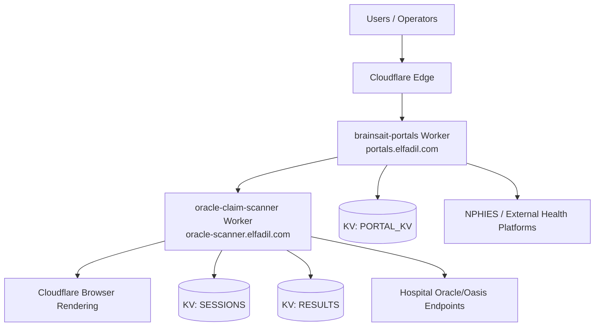
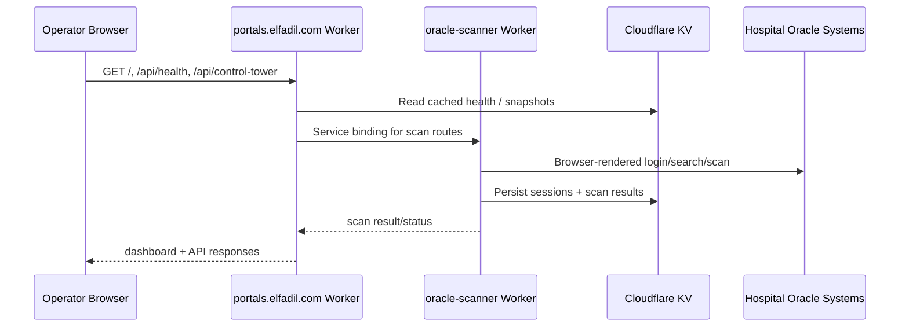
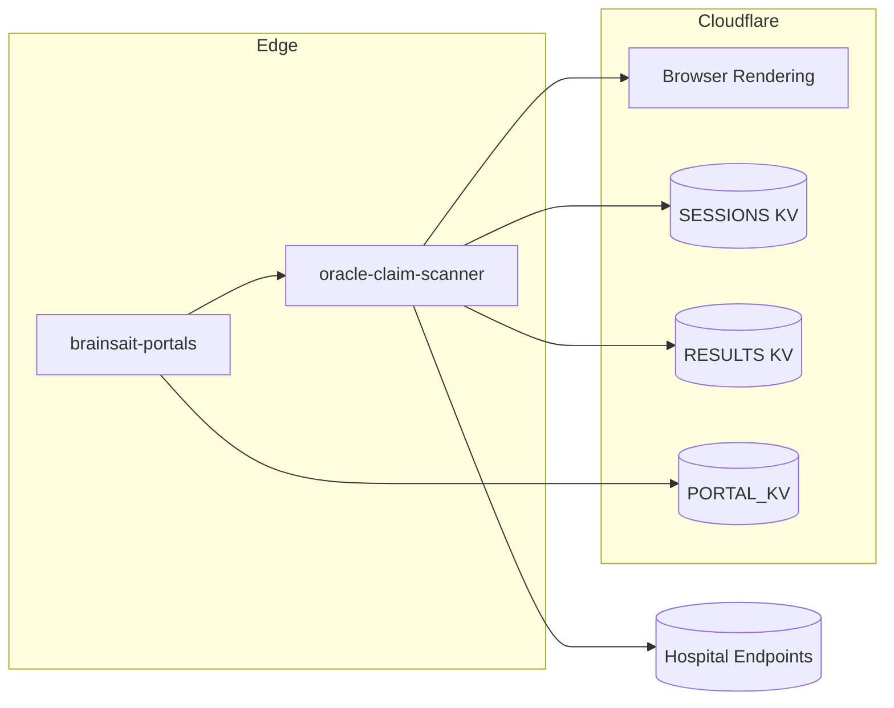
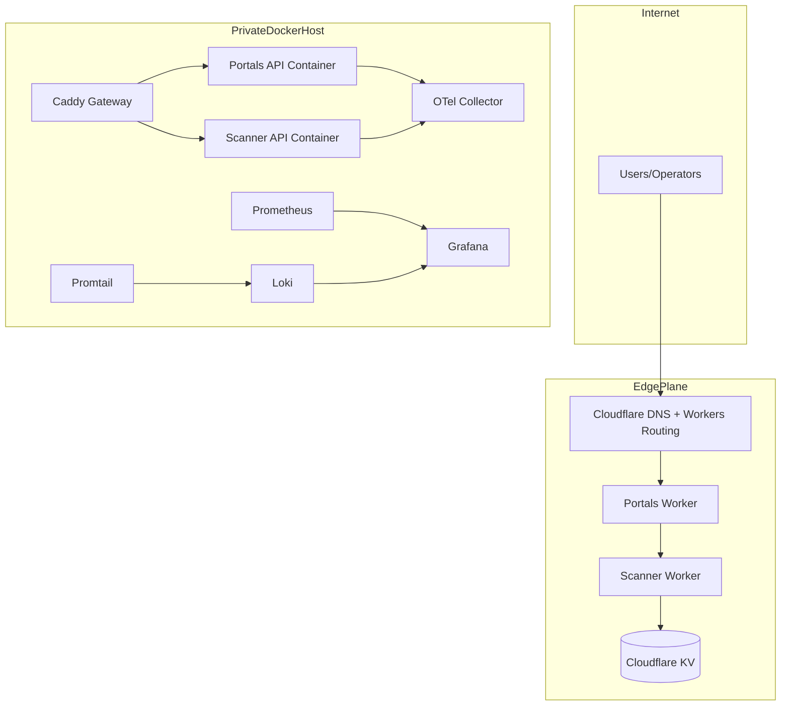

<!-- markdownlint-disable-file -->

# Autonomous Engineering Report

Date: 2026-03-27
Repository: https://github.com/Fadil369/oracle-setup.git
Primary Platform: https://portals.elfadil.com

## 1) System Overview

### Platform Summary
- Edge platform: Cloudflare Workers based control-plane and scanner services.
- Primary public entrypoint: `https://portals.elfadil.com`.
- Scanner service: `https://oracle-scanner.elfadil.com`.
- Runtime language mix:
  - JavaScript/Node (`*.js`, `*.mjs`) for workers and orchestration.
  - Python for FHIR/NPHIES validation modules.
  - TypeScript for integration typings/helpers under `uhh-integration/`.
- Local production stack uses Docker Compose (`docker-compose.production.yml`) with Caddy, app services, and observability.

### Discovered Technology Stack
- Frontend (live portal): server-rendered/static HTML+CSS from Cloudflare Worker (no SPA bundle fingerprint in initial payload).
- Backend/API: Cloudflare Worker route handlers in:
  - `src/index.js` (`oracle-claim-scanner`)
  - `infra-v3/portals-worker/src/index.js` (`brainsait-portals`)
- Data/cache services:
  - Cloudflare KV namespaces (SESSIONS, RESULTS, PORTAL_KV).
- Browser automation:
  - `@cloudflare/puppeteer` via Browser Rendering binding.
- Observability (Docker stack): OpenTelemetry Collector, Prometheus, Loki, Grafana.

### Live Portal Discovery Evidence
- Response headers indicate Cloudflare edge service and secure header baseline:
  - `server: cloudflare`
  - `x-frame-options: SAMEORIGIN`
  - `x-content-type-options: nosniff`
  - `x-xss-protection: 1; mode=block`
- HTML bootstraps as monolithic dashboard page with inline styles and no external JS framework bundle in first response block.

## 2) Architecture Map

### Component Diagram


### Data Flow Diagram


### Service Dependency Graph


## 3) Docker Infrastructure Discovery

### Runtime Snapshot
- `docker ps`: no active containers at audit time.
- `docker network ls`: only default local networks (`bridge`, `host`, `none`) active.
- Compose model resolved from `docker-compose.production.yml`.

### Container Architecture Map

| Container | Image | Ports/Expose | Networks | Dependencies | Notes |
|---|---|---|---|---|---|
| gateway | caddy:2.8 | 80, 443 | edge, platform | portals-api, scanner-api, grafana | reverse proxy / TLS edge |
| portals-api | ghcr.io/fadil369/brainsait-portals:latest | expose 8080 | platform | - | dashboard/control API |
| scanner-api | ghcr.io/fadil369/oracle-claim-scanner:latest | expose 8081 | platform | - | scanner worker runtime |
| otel-collector | otel/opentelemetry-collector-contrib:0.124.1 | expose 4317/4318/8889 | observability, platform | - | traces/metrics aggregation |
| prometheus | prom/prometheus:v3.2.1 | expose 9090 | observability | - | metrics store |
| loki | grafana/loki:3.4.3 | expose 3100 | observability | - | logs store |
| promtail | grafana/promtail:3.4.3 | internal | observability | loki | docker log shipping |
| grafana | grafana/grafana:11.6.0 | expose 3000 | observability, edge | prometheus, loki, promtail | dashboards |

## 4) MCP Integration Map

### Connected MCP Surface (from active tool access)
- Cloudflare account/resource MCP available and authenticated.
- Resource families reachable:
  - Accounts
  - Zones
  - Workers
  - R2 Buckets
  - D1 Databases
  - Integrations
  - Hyperdrive

### Protocol/Integration Characteristics
- API protocol: Cloudflare REST APIs through MCP wrappers.
- Authentication: pre-authorized account context in MCP runtime.
- Integration points in this system:
  - Worker deployment and route binding (`wrangler.toml`, `infra-v3/portals-worker/wrangler.toml`).
  - KV storage and Browser Rendering bindings.

## 5) Security Risk Assessment

### Critical
- None observed directly in committed files during this pass.

### High
1. Broad CORS policy in scanner worker preflight (`Access-Control-Allow-Origin: *`) for sensitive routes.
- Risk: unauthorized browser-origin integrations and attack surface expansion.
- Remediation: enforce allowlist origins and separate public/protected CORS policies.

2. API key auth only on sensitive routes without mandatory identity layer in code.
- Risk: key leakage enables broad control-plane access.
- Remediation: require Cloudflare Access service tokens/JWT validation in worker logic for privileged endpoints.

### Medium
1. Worker/service sprawl and naming inconsistency previously discovered in connected account inventory.
- Risk: ownership drift and shadow services.
- Remediation: enforce service inventory ownership tags and decommission SLA policy.

2. Runtime hardening gaps in compose baseline (partially remediated by this patch).
- Risk: container breakout impact and resource exhaustion.
- Remediation: no-new-privileges, capability drops, PID limits, tmpfs, health start periods.

3. Env file substitution includes placeholder defaults.
- Risk: accidental deployment with weak defaults.
- Remediation: CI policy gate to block `replace_me` values in deployment environments.

### Low
1. Legacy duplicate ESLint config style files (`eslint.config.mjs` and `.eslintrc.cjs`).
- Risk: configuration ambiguity.
- Remediation: standardize on ESLint flat config and remove legacy config after validation.

## 6) Performance Analysis

### Findings
- Cloudflare Worker architecture keeps latency low at edge for dashboard routes.
- Scanner workload is browser-automation heavy and can become CPU/memory bound under concurrency.
- Prometheus scrape targets include app metrics endpoints; good baseline for observability.

### Likely Bottlenecks
- Browser rendering per scan can be expensive; batch scans can spike memory and execution time.
- KV access patterns may increase response variance under hot paths if not cached in-request.
- Dashboard pages are large inline HTML/CSS; render payload could be optimized with caching and componentized assets.

### Optimization Plan
1. Introduce queue-based scan orchestration (producer/worker split) to smooth bursts.
2. Add per-route latency histograms and scanner duration metrics with cardinal labels (hospital, outcome).
3. Enable short-lived caching for public health/summary endpoints.
4. Add concurrency guards and backoff controls around scanner sessions.

## 7) Refactoring and Productionization Actions Executed

### Applied in this run
1. Docker hardening and observability upgrades:
- Added `no-new-privileges`, capability drop, PID limits, tmpfs, startup health periods.
- Added `promtail` service and config for centralized container log shipping to Loki.
- Added dependency ordering for gateway and grafana stack composition.

2. CI/CD security automation upgrades:
- Added dependency review gate for pull requests.
- Added CodeQL static analysis job for JavaScript.

## 8) Improved Repository Structure (Recommended)

```text
oracle-setup/
  apps/
    portals-worker/
    scanner-worker/
  packages/
    fhir/
    shared/
  infra/
    docker/
    observability/
    security/
  scripts/
  docs/
  tests/
```

Phased migration recommendation:
1. Move worker app code into `apps/` without behavior changes.
2. Keep `packages/fhir` as shared domain library.
3. Isolate deployment scripts under `scripts/` and platform configs under `infra/`.

## 9) Production Docker Configuration

- Base file: `docker-compose.production.yml` (updated)
- Added file: `infra/observability/promtail-config.yml`
- Security controls now include:
  - no-new-privileges
  - cap_drop on app-facing services
  - PID limits
  - tmpfs for transient writable paths
  - centralized bounded json-file logging

## 10) CI/CD Pipeline Blueprint

### Current + upgraded flow
1. CI (`.github/workflows/ci.yml`)
- Dependency review (PR only)
- Lint + tests on Node 20/22
- Trivy filesystem scan + SARIF upload
- CodeQL analysis

2. Container build/deploy (`.github/workflows/container-deploy.yml`)
- Tag-driven build, image scan, GHCR push
- Optional deployment webhook trigger

3. Release automation (`.github/workflows/release.yml`)
- Release Please on `main`

### Further recommended additions
1. Add SLSA provenance attestations for container builds.
2. Add branch protection policy requiring CI + CodeQL pass.
3. Add environment-protected deploy jobs with manual approval for production.

## 11) Observability Setup

### Metrics
- Prometheus scrapes:
  - prometheus
  - otel-collector
  - portals-api `/metrics`
  - scanner-api `/metrics`

### Logs
- Loki storage + Promtail shipping from Docker containers.

### Tracing
- OTLP receivers enabled in OpenTelemetry Collector.
- Export path in place for Prometheus metrics and debug traces.

## 12) Infrastructure Blueprint



## 13) Deployment Instructions

1. Prepare secrets:
- Copy `.env.production.example` to deployment secret store.
- Set strong values for API and Grafana credentials.
- Do not deploy with `replace_me` placeholders.

2. Validate compose config:
```bash
docker compose -f docker-compose.production.yml config
```

3. Start platform:
```bash
docker compose -f docker-compose.production.yml up -d
```

4. Verify health:
```bash
curl -fsSL https://portals.elfadil.com/health
curl -fsSL https://oracle-scanner.elfadil.com/health
```

5. Verify observability:
- Open Grafana and confirm Prometheus/Loki data sources.
- Confirm Promtail is pushing logs by querying recent container logs in Loki.

6. CI/CD governance:
- Enable branch protection for `main` requiring CI checks.
- Require signed/tagged releases for deployment workflow.

## 14) Remaining Engineering Backlog

1. Enforce strict CORS origin allowlist in worker code.
2. Implement Cloudflare Access token/JWT validation in privileged endpoints.
3. Add queue-based job orchestration for scanner workloads.
4. Add end-to-end synthetic checks and alert routing.
5. Add architecture conformance tests for routes/secrets/configs.
