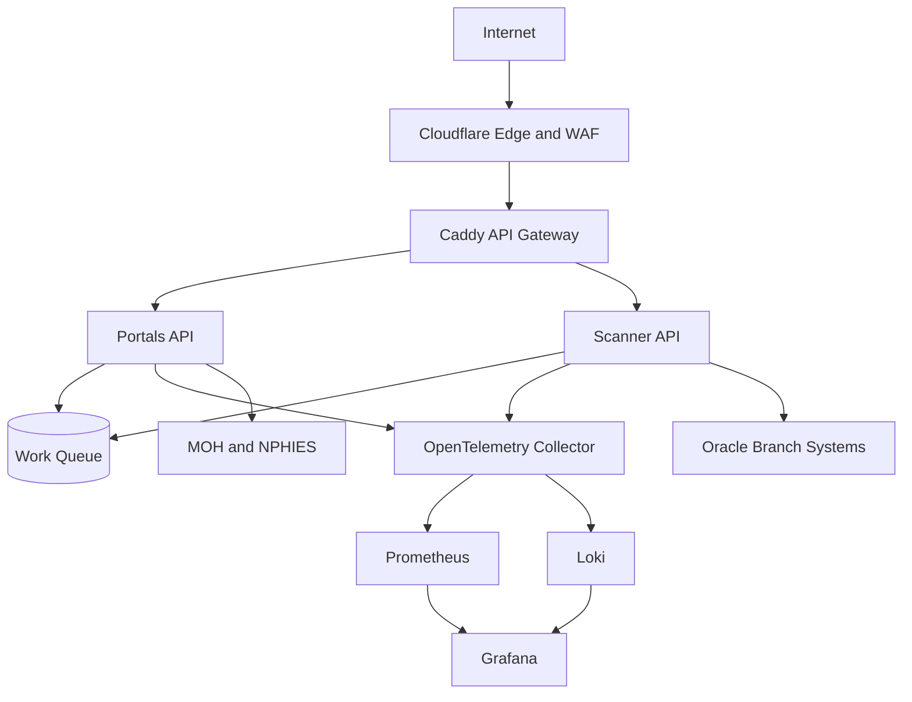

# Infrastructure Blueprint

## Target Production Architecture

## Docker Platform Design

Provided file: `docker-compose.production.yml`

Hardening included:

- Internal-only networks for platform and observability.
- Health checks for edge and app services.
- Restart policies (`unless-stopped`).
- Resource limits and reservations.
- Rotating json-file logging.
- Gateway termination and route-based traffic shaping.

## Secrets and Environment Isolation

- `env_file` references `.env.production` for runtime secrets.
- Example template in `.env.production.example`.
- API key authentication required by default.
- Explicit `ALLOW_UNAUTHENTICATED=1` needed to bypass auth for local debugging.

## Service Discovery and API Gateway

- Gateway routes:
  - `portals.elfadil.com -> portals-api:8080`
  - `oracle-scanner.elfadil.com -> scanner-api:8081`
  - `grafana.elfadil.com -> grafana:3000`
- Internal discovery via Docker service names on internal bridge networks.

## Fault Tolerance

- Restart policies for all services.
- Prometheus and Loki persistent volumes.
- Grafana persisted state and provisioned data sources.

## Next Production Enhancements

1. Replace bridge with orchestrator deployment (Kubernetes or Swarm).
2. Add autoscaling for scanner workers.
3. Add managed secrets store (Vault or cloud secret manager).
4. Add global rate limits and request budgets at gateway.
5. Add backup and restore policies for observability data.
