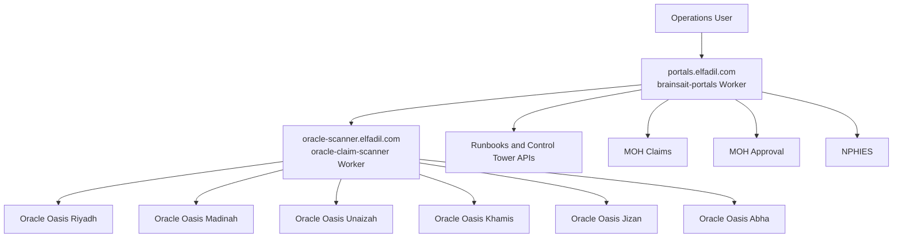
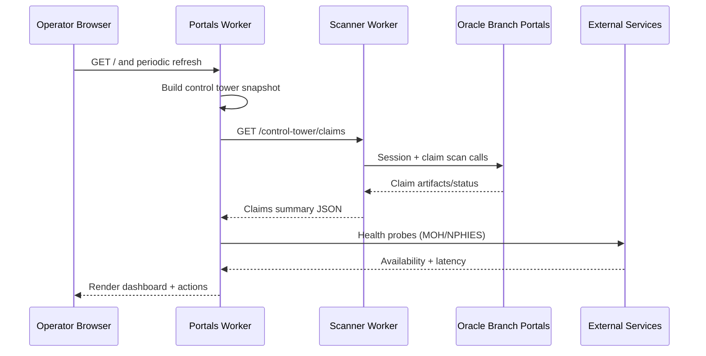
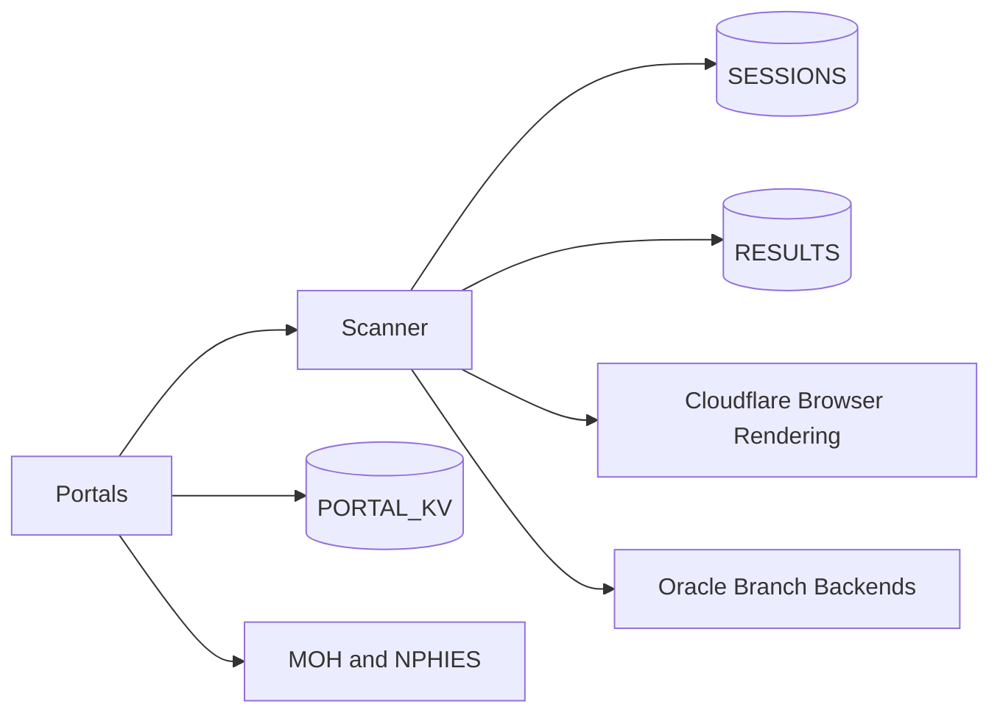

# Architecture Report

## System Overview

Primary platform is Cloudflare Worker based with a browser-automation worker (`oracle-claim-scanner`) and an orchestration/dashboard worker (`brainsait-portals`).

Detected stack:

- Frontend: Server-rendered static HTML/CSS/JS in Worker responses.
- Backend: Cloudflare Workers (JavaScript, nodejs_compat) with service bindings.
- Auth: API key on non-public endpoints (`Authorization: Bearer`, `X-API-Key`, query key fallback).
- Hosting: Cloudflare edge + route bindings for `portals.elfadil.com` and `oracle-scanner.elfadil.com`.
- Integrations: Oracle Oasis+ branch systems, MOH claims, MOH approval, NPHIES, FHIR/SBS pipelines.

## Component Diagram

## Data Flow Diagram

## Service Dependency Graph

## Container Architecture Map

Runtime discovery in this workspace:

- `docker ps`: no running containers.
- `docker compose config`: no compose file detected in current state.
- Docker daemon available with `overlay2`, cgroup v2, limits enabled.

Production blueprint is provided in `docker-compose.production.yml` with:

- `gateway` (Caddy reverse proxy)
- `portals-api`
- `scanner-api`
- `otel-collector`
- `prometheus`
- `loki`
- `grafana`

## MCP Integration Map

Observed MCP-related evidence:

- Platform references “MCP services” in operational narrative and scripts.
- No runtime MCP containers discovered in current Docker runtime.
- Integration points are currently edge/API-driven (Worker routes and runbooks), not local containerized MCP endpoints.

Recommended MCP production pattern:

- Put MCP services behind internal network only.
- Enforce service-to-service mTLS/API keys.
- Route all external access through API gateway with authn/authz.
