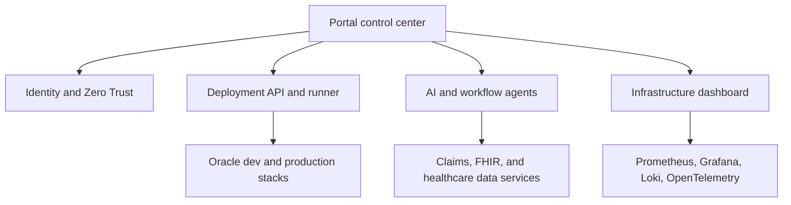

# BrainSAIT Control Center Architecture

## Current state

The repository already operates as a distributed control plane built on Cloudflare Workers:

- `src/index.js` exposes the Oracle claim scanner.
- `infra-v3/portals-worker/src/index.js` serves the BrainSAIT control tower.
- `docker-compose.production.yml` defines the hardened runtime and observability stack.

## Target state

## Core modules

1. Identity hub: Cloudflare Access today, extensible toward DID/OID and healthcare identity sources.
2. Agent control panel: orchestration surface for claims, compliance, and infrastructure agents.
3. Infrastructure dashboard: tunnels, workers, containers, APIs, storage, and observability health.
4. Automation builder: workflow-driven operational actions and deployment handoffs.

## Delivery principle

Keep the portal at the edge for fast orchestration and visibility. Delegate privileged execution to trusted runners through signed webhooks and explicit deployment plans.